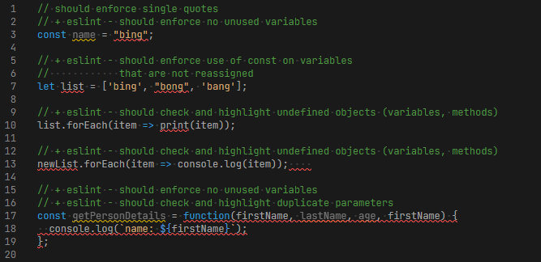
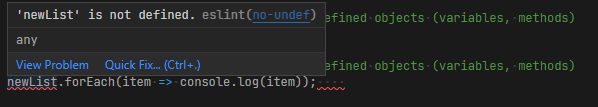
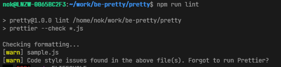
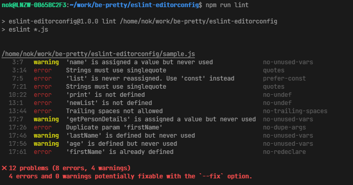

# Be Pretty

Its' good practise to have well formatted code and have this checked and performed consistently. This is a function well performed by [prettier](https://prettier.io/).

However, in addition to checking code format, it would be valuable to add some level of code analysis to find potential problems or errors with our code; as we run our build pipelines, or even better, as we write them.

This is where [eslint](https://eslint.org/), in addition to [editorconfig](https://editorconfig.org/) comes in. As a linter, in addition to checking (and fixing if we want) our format syle, we can also check for issues or errors with our code. And with the eslint extension added to our IDEs, we can have this feedback as soon as we write our code.

# Comparison

To see an example, there are two javascript projects in this repo:
- [pretty](./pretty) 
- [eslint-editorconfig](./eslint-editorconfig)

As the name suggest, these are two javascript projects each using the two different formatter/linter packages. 

There is a `sample.js` file on each project which has some code that we deemed to be 'incorrectly formatted'. And as you go through setting up and installing the npm packages and recommended IDE (vs code) extensions on the repo, you should see how these two repos react to the `sample.js` file.

## Results

With the addition of the eslint extension, we should see that we are highlighting the formatting errors as we write our code, and in addition, it also highlights to use some syntax issues and errors as well.

The error description is also available from the IDE

And with the addition of editorconfig, some, if not most of our formatting standards will be automatically applied to our code as soon as we save our changes. These are the likes of trimming trailing whitespace and adding a new line on end of file.

### Running npm lint scripts

Comparing terminal logs when running lint scripts

#### Prettier

#### ESLint
We know where our issues are and is actionable (In addition to our IDE highlighting it for us)

## Summary

Although we are applying consistent code formatting and style, we can get more value by having a linter that checks for code issues and errors, in addition to checking formatting. And having eslint with editorconfig used will provide this not only as we run our build pipelines, but as soon as we write our next line of code.
